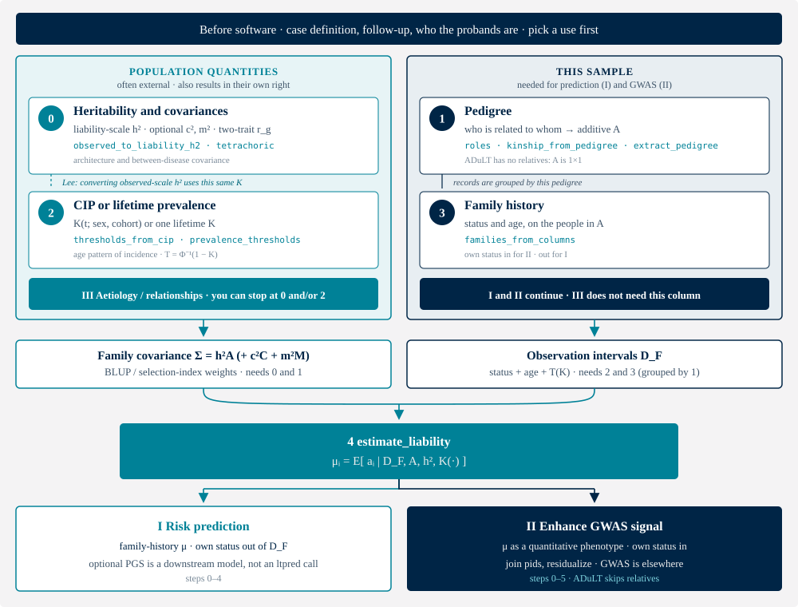

# Vignette: how to run ltpred

ltpred estimates each proband's posterior mean genetic liability

$$
\mu_i = \mathbb{E}\bigl[a_i \mid D_F,\, A,\, h^2,\, K(\cdot)\bigr]
\tag{1}
$$

and writes it as the `genetic` column. That column is not a SNP polygenic
score and not an absolute risk. What you *do* with it — and whether you
need it at all — depends on the use. Pearson–Aitken (PA) is the
single-trait default; Gibbs is the sampler.

There are at least three uses. Pick one before building $D_F$: own
status in versus out is not a later toggle.

**Table 1.** Three uses. Use III can stop at step 0 and/or 2; I and II
need the estimator.

| | Question | Steps | Own status | Notes |
|---|---|---|---|---|
| **I** | Risk prediction from family history, optionally with a PGS | 0–4 | **out** of $D_F$ | $\mu_i$ is a predictor of the diagnosis, so that diagnosis must not leak into it. A PGS is a **downstream** combination ([Hujoel et al. 2022](https://doi.org/10.1016/j.xgen.2022.100152); [Dybdahl Krebs et al. 2026](https://doi.org/10.1016/j.ajhg.2025.11.016)), not an ltpred call. |
| **II** | Enhance the association signal in a GWAS | 0–5 | **in** | $\mu_i$ is a quantitative GWAS phenotype of that diagnosis ([Hujoel et al. 2020](https://doi.org/10.1038/s41588-020-0613-6)). ADuLT skips relatives (steps 1 and 3). |
| **III** | Disease relationships and aetiology | **0 and/or 2** | — | Liability-scale $h^2$ and $r_g$ constrain genetic architecture and how two diseases relate. The CIP is the age/sex/cohort pattern of incidence. Pedigree, family history and $\mu_i$ are optional here. |

Equation (1) names four inputs. Figure 1 is that recipe as a flow, with
the three uses as exits. Table 2 lists the corresponding calls. You are
not missing a hidden software step. Classic LT-FH uses one lifetime $K$
in step 2 instead of a CIP curve. Two-trait work adds a genetic
covariance in step 0 and uses Gibbs in step 4.



**Figure 1.** How the inputs assemble, and where you can stop. The left
column is the population model: liability-scale $h^2$ (optional $c^2$,
$m^2$, $r_g$) and the CIP or lifetime $K$. **Use III can stop there.**
The right column is this sample: the pedigree $A$ and the relatives'
(and optionally the proband's) status and age. Those become
$\Sigma=h^2A$ and the observation intervals $D_F$. Step 4 is the first
call that conditions on all four. **Use I** takes $\mu_i$ with own
status out; **use II** takes $\mu_i$ with own status in and hands it to
a GWAS (not an ltpred routine).

The numbering is the order you assemble (1), not a Gantt chart. Steps
0–3 can be prepared in parallel except for three real dependencies:

1. **$h^2$ scales $A$.** You can build the pedigree without a
   heritability, but you cannot form $\Sigma=h^2A$ without both 0 and 1.
   ADuLT is the $1\times 1$ case.
2. **CIP before family history.** Status and age are a register table
   until $T_i=\Phi^{-1}(1-K_i)$ turns them into intervals on liability.
   That is why 3 follows 2.
3. **Pedigree before family history.** Rows of $D_F$ are grouped by
   `fam_id` / roles (or kinship column order). That is why 3 follows 1.

Lee's map is the only backward arrow: converting an observed-scale
$h^2$ uses the same population $K$ as the thresholds.

**Table 2.** What to do, in order. Function names only; the dependencies
are in Figure 1. Skip steps that Table 1 says the use does not need.

| Step | You supply | ltpred |
|---|---|---|
| — | Case definition, who the probands are | not software |
| 0 | Liability-scale $h^2$; optional $c^2$, $m^2$; two-trait $r_g$ | `observed_to_liability_h2`, `tetrachoric`; optionally `fit_heritability` |
| 1 | Who is related to whom | roles, or `kinship_from_pedigree` / `extract_pedigree` |
| 2 | Prevalence or CIP $K(\cdot)$ | `prevalence_thresholds` or `thresholds_from_cip` |
| 3 | Status and ages (family history) | `families_from_columns` |
| 4 | — | `estimate_liability` |
| 5 | People to score (I) or genotype (II) | join `pids`; GWAS / PGS combination is elsewhere |

A compact script that prints the numbers below is
[`examples/vignette.py`](https://github.com/bvilhjal/ltpred/blob/main/examples/vignette.py)
(`pip install -e ".[fast]"` then `python examples/vignette.py`). Quoted
figures use seed 1, $n=800$ nuclear families, true $h^2=0.5$, $K=0.05$.
They check the API; they are not a benchmark. On real data, skip the
simulator and start from your table.

## Before software

Fix a case definition, follow-up, and a family-history source that you are
willing to defend
([checklist](assumptions.md#real-data-checklist)). Decide who the
**probands** are (usually the genotyped people). Pick a row of Table 1.
Uses I and II disagree on whether the proband's own diagnosis enters
$D_F$; that choice is used in step 3, not as a later toggle on the
estimator. Use III may not need a pedigree at all.

## 0. Heritability and covariances

For uses I and II, `estimate_liability` **conditions** on $h^2$. Pass a
**liability-scale** value. An observed-scale number mis-calibrates
$\hat{\mu}_i$ (ranking is more robust than the scale). For use III, $h^2$
and $r_g$ can *be* the result.

Prefer an external estimate. A first-degree check is Falconer's
$h^2 \approx 2\rho_{\mathrm{tet}}$. The Lee map from an observed-scale
estimate in a **population** sample is

$$
h^2_{\mathrm{liab}}
  = h^2_{\mathrm{obs}} \cdot \frac{K(1-K)}{\varphi(T)^2},
  \qquad
  T=\Phi^{-1}(1-K).
\tag{2}
$$

$K$ here is the same population prevalence as step 2 (the CIP plateau, or
the single lifetime $K$ of classic LT-FH). If the GWAS over-samples cases,
pass that fraction as `prop_cases`.

```python
from ltpred import tetrachoric, observed_to_liability_h2

po = tetrachoric(status_o, status_m)   # parent–offspring statuses
2 * po.rho
float(observed_to_liability_h2(0.20, pop_prev=0.05))  # 0.893 at K = 0.05
```

On the simulated cohort below, $\rho_{\mathrm{tet}}=0.237$ so
$2\rho_{\mathrm{tet}}=0.474$ against truth $0.5$.

Optional sibship $c^2$ and couple $m^2$ go on the single-trait estimator
as `c2` / `m2` ($h^2+c^2+m^2\le 1$). Two traits need liability-scale
heritabilities **and** a genetic correlation: pass vector `h2`,
`genetic_corrmat`, and `full_corrmat` (Gibbs only).

Fitting $h^2$ or $A{+}C{+}M$ from the **same** families is a different
contract: independent, non-overlapping pedigrees, `sampling="population"`
or `sampling="ipw"` with known positive inclusion probabilities. A `pid`
in two `fam_id`s is rejected. Unguarded ascertainment pins $\hat{h}^2=1$
even when the truth is 0. Details: [Inference](inference.md).

## 1. Pedigree

You need $A$, the additive relationships among the people whose records
enter $D_F$. Two routes.

**Role grammar** (nuclear and common extended families). Each label is
relative to the proband: `o` (optional own status), `m`/`f`, `s1`/`s2`,
grandparents `mgm`/`pgf`, half-sibs `mhs1`/`phs1`, avuncular `mau1`/`pau1`,
children `c1.1`. Number repeats. Same-side half-sibs are treated as full
sibs of each other — use the kinship path if that is false
([role grammar](data-preparation.md#role-grammar)).

**Parent pointers**, for cousins, inbreeding, or messy second parents:

```python
from ltpred import kinship_from_pedigree, extract_pedigree, build_parent_graph

_, A = kinship_from_pedigree(ids, father, mother)
# from population trio records:
graph = build_parent_graph(ids, father, mother)
ped = extract_pedigree(graph, proband_id, max_degree=3)
```

Scoring may use overlapping extracted pedigrees (one per proband). Fitting
$h^2$ in step 0 may not. ADuLT has no relatives: skip this step.

## 2. CIP or lifetime prevalence

For use III the CIP *is* the result: the age, sex and cohort pattern of
incidence. For uses I and II it is an input to the thresholds below.

Thresholds give the interval for each observed liability. Classic LT-FH
uses one $T=\Phi^{-1}(1-K)$. LT-FH++ and ADuLT use a person-specific CIP

$$
T_i = \Phi^{-1}\bigl(1 - K(t_i; s_i, b_i)\bigr),
\tag{3}
$$

with $t_i$ the age of onset for a case and the age at last follow-up for a
control. Use a **population** curve, stratified by sex, birth year, and
ancestry where incidence differs — not the logistic demo helper and not a
biobank case fraction. Competing death: Aalen–Johansen, not Kaplan–Meier
that treats death as censoring ([CIP estimation](cip-estimation.md)).
Cover every analysed age; pass `k_pop` unless the last CIP value is a
defensible lifetime prevalence.

```python
from ltpred import (
    prevalence_thresholds, thresholds_from_cip,
    kaplan_meier_cip, aalen_johansen_cip,
)

# classic LT-FH: one K
lower, upper = prevalence_thresholds(status, pop_prev=K)

# LT-FH++ / ADuLT: one call per stratum
lower, upper, K_i, K_pop = thresholds_from_cip(
    status, age, cip_ages, cip_values, k_pop=lifetime_K, case_mode="pin",
)
```

`case_mode="pin"` is the LT-FH++ encoding (a case is a point mass at
$T_i$). Pin only when onset is the CIP inverse of liability. Most of the
onset information survives $[T_i,\infty)$. Base PA-FGRS instead uses the
**lifetime** case interval $[\Phi^{-1}(1-K_{\mathrm{pop}}),\infty)$ and
puts age into a censored control's mixture weight $K_i$.

## 3. Family-history records

One row per observed person: `fam_id`, `role` (or a kinship column order),
`status`, `age`. Missing `fam_id` and duplicate roles in a family are
rejected. Join these records to the pedigree from step 1; the thresholds
from step 2 are the `lower` / `upper` columns.

Include role `o` for **use II** ($\mu_i$ is a GWAS phenotype of that
diagnosis). Omit `o`, or give it $(-\infty,\infty)$, for **use I** (the
same diagnosis is the prediction target). ADuLT with `o` unbound has
nothing left to condition on. Use III may skip this step.

```python
from ltpred import families_from_columns

families = families_from_columns(
    fam_id, role, lower, upper, pid=pid,
    K_i=K_i, K_pop=K_pop,   # only for use_mixture=True
)
```

## 4. Estimate $\mu_i$

This is the ltpred run. Everything above is input.

```python
from ltpred import estimate_liability

res = estimate_liability(families, h2=h2)          # PA, single trait
# res = estimate_liability(families, h2=h2, method="gibbs", seed=1)
# res = estimate_liability(families, h2=h2, use_mixture=True)
score = res.genetic                                # aligned to res.pids
```

- `res.se["genetic"]` is Monte-Carlo error in $\hat{\mu}_i$ (exactly 0
  under PA).
- `res.var["genetic"]` is $\mathrm{Var}(a_i\mid D_F)$, which does not
  shrink with more draws.

PA is the default for one trait. Use Gibbs for a Monte-Carlo SE, multiple
traits, or an unusual no-mixture pedigree. The PA-FGRS mixture is PA-only.
The kinship entry point is `estimate_liability_from_kinship(A, lower,
upper, h2=h2, target=0)`.

With relatives and a personalised CIP this is LT-FH++; with only role `o`
it is ADuLT; with one lifetime $T$ and relatives it is classic LT-FH.

## 5. What you do with $\mu_i$

**Use I (prediction).** Join `res.pids` to the people whose risk you
want. Do not put the predicted diagnosis into $D_F$. A PGS, if you have
one, is combined **after** this step — a target-population prediction
model, not something ltpred fits
([Hujoel et al. 2022](https://doi.org/10.1016/j.xgen.2022.100152);
[Dybdahl Krebs et al. 2026](https://doi.org/10.1016/j.ajhg.2025.11.016)).

**Use II (GWAS).** Join `res.pids` to genotyped IDs. Residualize for sex,
cohort, PCs, and batch, or put them in a mixed model. Prefer an
association method that handles relatedness if related targets remain.
ltpred does not run the GWAS.

**Use III** does not need this step. The quantities of interest were $h^2$,
$r_g$, and/or $K(\cdot)$ in steps 0 and 2.

## Stand-in cohort (simulated classic LT-FH)

The script builds a nuclear cohort so the calls above have something to
chew. `use_age=False` is classic LT-FH: one $K$, not a CIP. On real data
this block is your table, not a simulator.

```python
from ltpred import simulate_under_LTM_single, estimate_liability
import numpy as np

h2, K, n_fam = 0.5, 0.05, 800
sim = simulate_under_LTM_single(
    fam_vec=["m", "f", "s1"], h2=h2, pop_prev=K, n_sim=n_fam,
    use_age=False, seed=1,
)
pa = estimate_liability(sim.families, h2=h2)
status = sim.status["o"].astype(float)
true_g = sim.genetic

np.corrcoef(status, true_g)[0, 1]       # 0.342
np.corrcoef(pa.genetic, true_g)[0, 1]   # 0.419
```

An affected proband: $\hat{\mu}_i=+0.947$, posterior variance $0.271$.
An unaffected one: $\hat{\mu}_i=-0.119$, variance $0.430$. Relatives only
(no role `o`): $\operatorname{Corr}=0.268$. ADuLT at one lifetime $T$
matches the 0/1 label ($\operatorname{Corr}=0.342$). PA versus Gibbs on 80
families: $\operatorname{Corr}=0.9997$. Rebuilding the same families from
columns, and scoring them through `kinship_from_pedigree`, recovers the
role-grammar PA scores to numerical noise.

## Where to go next

| | |
|---|---|
| One-page copy-paste | [Quickstart](quickstart.md) |
| Which model to run | [Choose a method](guide.md) |
| Roles, trios, real tables | [Data preparation](data-preparation.md) |
| Kaplan–Meier / Aalen–Johansen (use III may stop here) | [CIP estimation](cip-estimation.md) |
| Engines, scaling, GWAS export | [Estimation](estimation.md) |
| Fitting $h^2$ / $A{+}C{+}M$ | [Inference](inference.md) |
| Pre-flight list | [Assumptions & checklist](assumptions.md) |
| Maths of (1) | [Algorithm](algorithm.md) |
